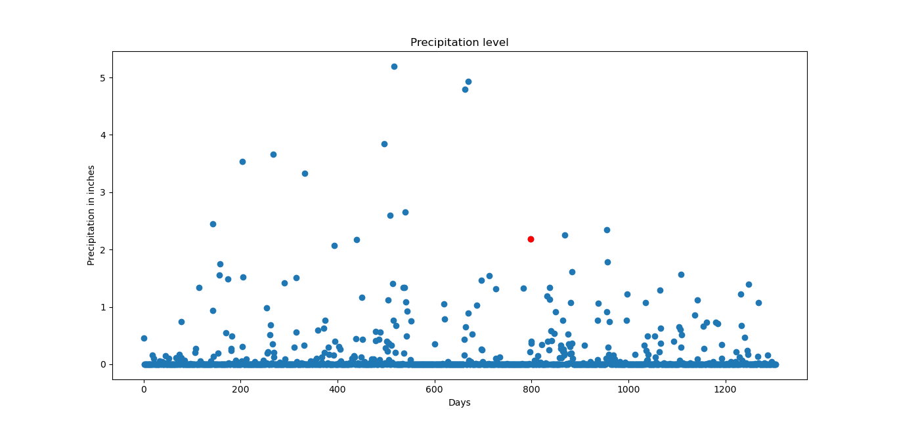
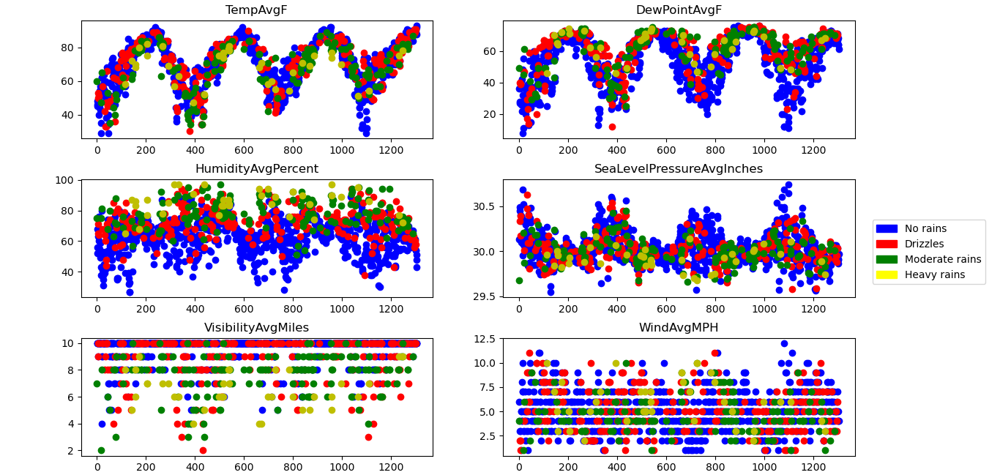

## RAINFALL PREDICTION MODEL
This repository builds a Linear and a Logistic Regression model to predict the rainfalls. The model is supposed to predict whether it is supposed to:
    - Rain
    - Drizzle
    - Moderate Rain
    - Heavy Rain

The following dataset constitutes the weather data, including temperature, humidity, dewpoints, etc: 

    https://github.com/vijaya123456/Rainfall-prediction-classifier/blob/main/public/rainfall-dataset.csv
    

Manually classifying the precipitation levels into 4 different classes as follows:

- No Rain: precipitation<0.001
- Drizzle: 0.001<=precipitation<0.1
- Moderate Rains: 0.1<=precipitation< 1.2
- Heavy Rains: precipitation>=1.2

## GET STARTED

    1) Fork the repository, https://github.com/vijaya123456/Rainfall-prediction-classifier.git
    2) Run the model classifiers in rainfall-prediction folder, linearRegression.py and logisticRegression.py
    3) Revamp and do pull request.
    
## RESULTS
After running Predictions for an arbitrary day with hardcoded input parameters.

Below are the graphs we obtain after classifying express various trends which tie rainfall and humidity, visibility and temperature together.

## CONCLUSIONS
For improvements on model, the following can be applied:
Resampling of the dataset. This helps in improving the performance of our model.
One can decide to divide the data into a ratio of one is to one(1:1). That is, Have a method that does
preprocesses data into 50-50 ration.

Another application to buy is to making sure accuracy is improved is choosing a threshold value to apply. This increases efficiency as well.

